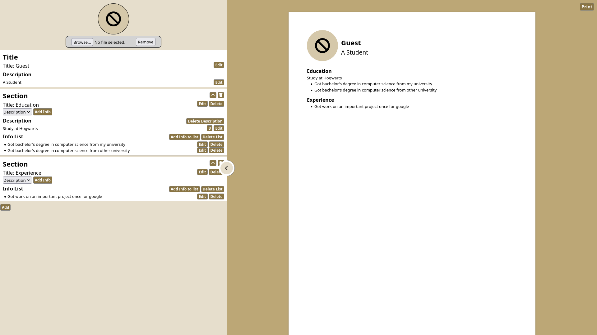

# My React CV Applications

## Introduction

This is a project that was made based on the condition below from [The Odin Project Website](https://www.theodinproject.com/lessons/node-path-react-new-cv-application).

1. Create a new React project.

2. Think about how to structure your application into components. Your application should include: 
    1. A section to add general information like name, email and phone number.
    2. A section to add your educational experience (school name, title of study and date of study)
    3. A section to add practical experience (company name, position title, main responsibilities of your jobs, date from and until when you worked for that company)

3. Be sure to include an edit and submit button for each section or for the whole CV. The submit button should submit your form and display the value of your input fields in HTML elements. The edit button should add back (display) the input fields, with the previously displayed information as values. In those input fields, you should be able to edit and resubmit the content. You’re going to make heavy use of state and props, so make sure you understood those concepts.

4. Create a components directory under your src directory and add your components.

5. Include a styles directory under your src directory for your CSS files. You’ll need to import these in the component files to use them.

6. Push the results and deploy them with any of the options mentioned below. At this point of the curriculum, it doesn’t matter which platform you choose as long as your project is live on the internet!

## Usage

Install the required dependencies from npm
```
npm install
```

Run the website from React directly
```
npm run dev
```

Build the website and run live-server in the dist folder
```
npm run build
```

## GUI
<div align="center">
    
    
</div>

## On Netlify
This website is been deployed on [Netlify](https://chic-sunshine-eda07e.netlify.app/)

## Note
When clicked on Print to save CV as PDF, please the setting below to make the CV appeared properly:
- Paper Size: A4
- Margin: None
